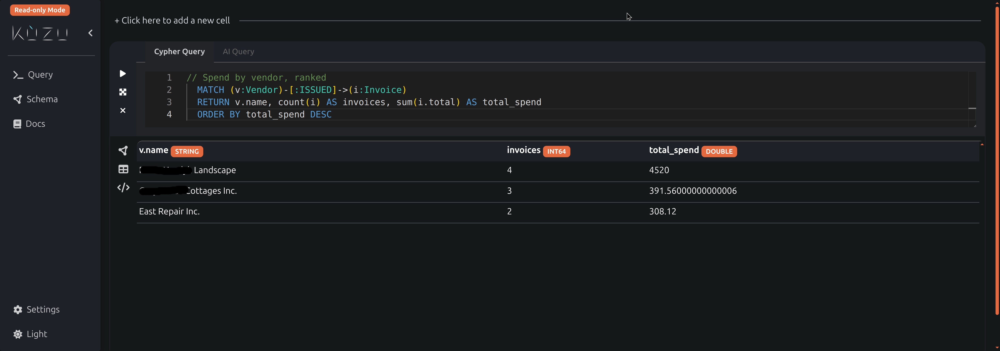
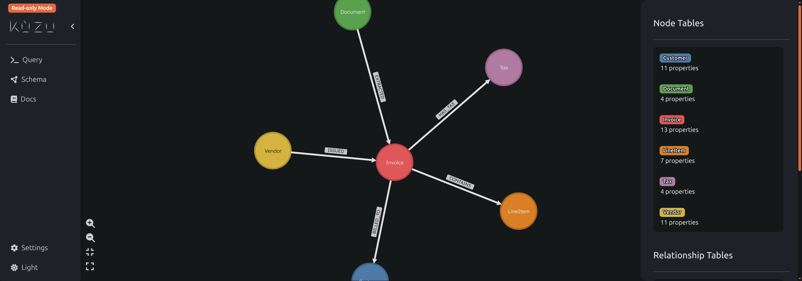

# Invoice Pipeline

A fully local, end-to-end pipeline that turns invoice PDFs and images into a
queryable knowledge graph. Drop a file into a folder, the pipeline extracts
structured data with a vision LLM running on `llama.cpp`, then upserts the
result into a [Kuzu](https://kuzudb.com) graph database for ad-hoc Cypher
queries.

No cloud APIs, no SaaS, no per-token billing. Everything runs on your own
hardware.

### Here is the query — ad-hoc Cypher against your own invoices



### Here is the schema — a property graph the LLM populates automatically



## What it does

```
PDF / image  ─►  watcher  ─►  vision LLM  ─►  result.json  ─►  Kuzu graph  ─►  queries
                  (daemon)    (Qwen3-VL via                    (entity-resolved
                              llama.cpp)                        Vendor / Customer /
                                                                Invoice / LineItem)
```

- **Folder watcher daemon** monitors `~/invoice-inbox/{pdf,images}` and batches
  new files for processing.
- **On-demand `llama-server`** starts only when there's work to do; stops when
  idle. Saves VRAM.
- **Per-file output folders** under `~/invoice-inbox/output/<run>/` containing
  the original file and the structured `result.json`.
- **Auto-ingest into Kuzu** with entity resolution (vendors and customers are
  deduplicated by tax-id → email → name+postal_code+country).
- **Atomic writes** — each invoice is upserted in a Cypher transaction with
  `coalesce` semantics so a sparse re-extraction can't blank out previously
  good data.
- **Daemon lockfile** prevents concurrent writers from corrupting the graph.

## Prerequisites

Tested on Ubuntu 24.04 (Linux 6.17) with an NVIDIA GPU. Should work on any
modern Linux.

### System packages

```bash
sudo apt update
sudo apt install -y python3 python3-venv git build-essential cmake \
                    libcurl4-openssl-dev pkg-config
```

For Kuzu Explorer (optional, GUI for browsing the graph):

```bash
sudo apt install -y docker.io
sudo usermod -aG docker $USER   # log out / back in for group change to apply
```

### llama.cpp (the inference engine)

Build from source — the `llama-server` binary serves the vision model.

```bash
git clone https://github.com/ggml-org/llama.cpp ~/Projects/llama.cpp
cd ~/Projects/llama.cpp
cmake -B build -DGGML_CUDA=ON      # drop -DGGML_CUDA=ON for CPU-only
cmake --build build --config Release -j
```

The binary will be at `~/Projects/llama.cpp/build/bin/llama-server`.

### Vision model

Download Qwen3-VL-4B-Instruct (Q4_K_M quant) plus its multimodal projector
from Hugging Face:

```bash
mkdir -p ~/Projects/models
cd ~/Projects/models
# Main model + mmproj — ~3GB total
wget https://huggingface.co/Qwen/Qwen3-VL-4B-Instruct-GGUF/resolve/main/Qwen3-VL-4B-Instruct-Q4_K_M.gguf
wget https://huggingface.co/Qwen/Qwen3-VL-4B-Instruct-GGUF/resolve/main/mmproj-Qwen3-VL-4B-Instruct-F16.gguf
```

(Any vision-capable GGUF model that `llama.cpp` understands will work — the
config takes paths to a model + mmproj pair.)

### invoice-processor (companion package)

The pipeline shells out to a separate `invoice-processor` CLI that knows how
to crop / page-split / call the vision server. Clone and install it in its
own venv:

```bash
git clone https://github.com/BitnPi/invoice-processor ~/Projects/invoice-processor
cd ~/Projects/invoice-processor
python3 -m venv .venv
.venv/bin/pip install -e .
```

## Install the pipeline

```bash
git clone https://github.com/BitnPi/invoice-pipeline ~/invoice-pipeline
cd ~/invoice-pipeline
python3 -m venv .venv
.venv/bin/pip install -e .
.venv/bin/invoice-pipeline init
```

`init` creates the standard folder layout under `~/invoice-inbox/`:

```
~/invoice-inbox/
├── pdf/         # drop PDF invoices here
├── images/      # drop image invoices here
├── output/      # extraction results land here, one folder per run
├── archive/     # processed originals are moved here, dated by type
├── logs/
└── graph_db     # Kuzu single-file database
```

## Configure

Edit `config.yaml` to match where you put llama.cpp, the model, and the
companion processor venv. The defaults assume the prerequisite layout above.

```yaml
server:
  binary: ~/Projects/llama.cpp/build/bin/llama-server
  model: ~/Projects/models/Qwen3-VL-4B-Instruct-Q4_K_M.gguf
  mmproj: ~/Projects/models/mmproj-Qwen3-VL-4B-Instruct-F16.gguf
  port: 8081
  gpu_layers: 99             # -1 / 0 for CPU
  parallel_slots: 4

processor:
  venv_path: ~/Projects/invoice-processor/.venv
  workers: 4

graph:
  db_path: ~/invoice-inbox/graph_db
  auto_ingest: true          # set false to skip graph upsert during run
```

A second config (`config-glm.yaml`) is included as a starting point if you
want to swap in GLM-OCR instead of Qwen3-VL.

## Run

### One-shot — process whatever's in the watch folders, then exit

```bash
.venv/bin/invoice-pipeline run
```

### Daemon — keep watching for new files

```bash
.venv/bin/invoice-pipeline run --daemon
```

### Process specific files explicitly

```bash
.venv/bin/invoice-pipeline process /path/to/invoice1.pdf /path/to/receipt.jpg
```

### Pipeline status

```bash
.venv/bin/invoice-pipeline status
```

### Re-ingest existing extractions into the graph

If you have `result.json` files from previous runs and want to (re)build the
graph from them:

```bash
.venv/bin/invoice-pipeline graph
```

This walks `~/invoice-inbox/output/` and upserts every `result.json` it finds.
Idempotent — re-running won't duplicate invoices.

## Query the graph

### Canned reports

```bash
.venv/bin/python scripts/queries.py
```

Prints vendor counts, line items, and grand total. A starting point — edit
the script or write your own.

### Kuzu Explorer (web UI)

A Docker-based GUI for visual schema browsing and Cypher exploration:

```bash
./start_explorer.sh
```

Then open http://localhost:8000. Read-only by default so it can run alongside
the pipeline daemon without conflicting on the writer lock.

To stop: `sudo docker stop kuzu-explorer`.

### Direct Cypher from Python

```python
import kuzu
db = kuzu.Database("~/invoice-inbox/graph_db")
conn = kuzu.Connection(db)
r = conn.execute("MATCH (v:Vendor)-[:ISSUED]->(i:Invoice) "
                 "RETURN v.name, count(i) AS n, sum(i.total) AS spend "
                 "ORDER BY spend DESC")
while r.has_next():
    print(r.get_next())
```

## Graph schema

```
            ┌──────────┐
            │ Document │   id = sha256(source file content)
            └────┬─────┘
                 │ EXTRACTED
                 ▼
  ┌────────┐ ISSUED  ┌─────────┐ BILLED_TO  ┌──────────┐
  │ Vendor │────────▶│ Invoice │───────────▶│ Customer │
  └────────┘         └────┬────┘            └──────────┘
                CONTAINS  │  HAS_TAX
                ┌─────────┴──────────┐
                ▼                    ▼
          ┌──────────┐         ┌─────┐
          │ LineItem │         │ Tax │
          └──────────┘         └─────┘
```

Vendor and Customer IDs use a deterministic ER waterfall:
`tax_id` → `email` → `name+postal_code+country`. So the same vendor across
multiple invoices collapses to one node even when the LLM extracted slightly
different name spellings.

## Run as a systemd user service (optional)

```bash
mkdir -p ~/.config/systemd/user
cp invoice-pipeline@.service ~/.config/systemd/user/
systemctl --user daemon-reload
systemctl --user enable --now invoice-pipeline@$USER
journalctl --user -u invoice-pipeline@$USER -f
```

## Troubleshooting

- **`llama-server` won't start** — verify `binary`, `model`, and `mmproj`
  paths in `config.yaml` exist; check `~/invoice-inbox/logs/pipeline.log`.
- **Files aren't being picked up** — confirm extension is in
  `extensions:` in `config.yaml` and the file landed in a configured
  `watch_folders:` directory.
- **Explorer says "Cannot create an empty database under READ ONLY mode"** —
  check the `KUZU_FILE` env var inside `start_explorer.sh` is the *relative*
  filename (`db.kuzu`), not the absolute path.
- **`graph` subcommand refuses with "daemon already holds the graph lock"** —
  the daemon is running. Stop it (`systemctl --user stop ...` or Ctrl-C),
  then re-run `graph`.

## License

MIT — see [LICENSE](LICENSE).
